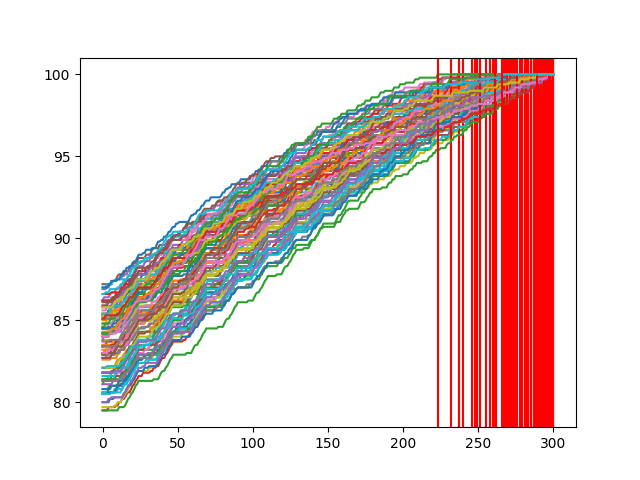

# AlgorithmVisualizer
Simple program to visualize how many steps sorting algorithms need to make.

### Results
As we can see from the picture it takes around 275 steps for an array with a length 25 to be sorted. Each red line demonstrates in which step the algorithm has finished and the array is now sorted. Each steps consists of two array members switching places

